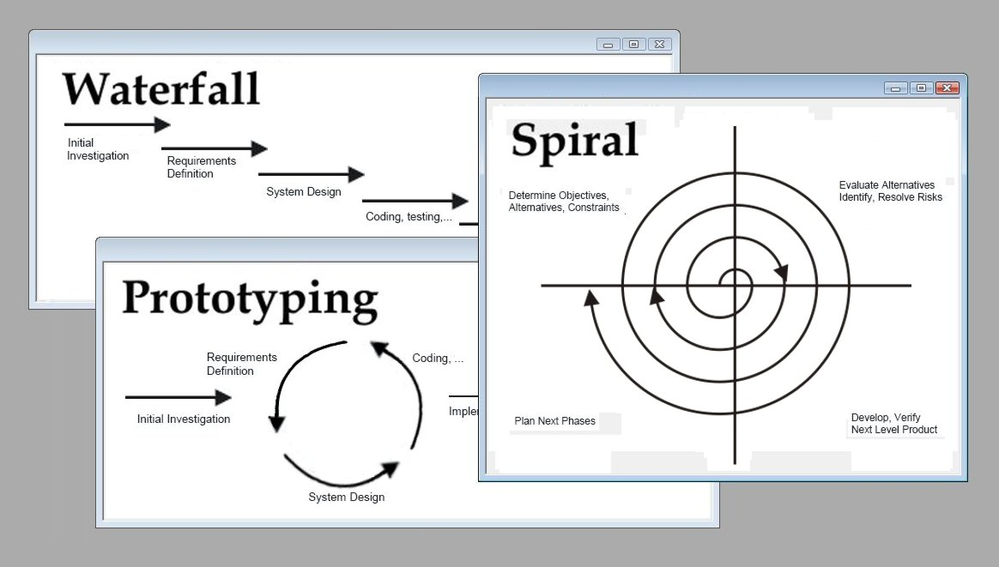

title: DevOps - Getting Started
author:
  name: Fazreil Amreen
  twitter: fab52
  url: https://www.facebook.com/fazreil/
output: presentation.html
controls: true

---

# 1.0 Intro to DevOps

---

 DevOps is an acronym for Development Operations. Before DevOps was cool, DevOps was just software configuration management. Now DevOps extends to the whole stretch across SDLC.

---

source: [cacoo.com](https://cacoo.com/wp-app/uploads/2021/06/continuous-development-visual.png)

---

# 2.0 DevOps Roadmap:

---

I listed stages below for the roadmap to reach DevOps maturity

1. Version control
1. Build mechanism
1. Centralized build
1. Infrastructure provisioning
1. Build bakery

---

It is always recomended to tackle DevOps step by step. The following topics describe how to tackle DevOps from infancy to its maturity.

---

source: [businesswire](https://mms.businesswire.com/media/20200623005141/en/800268/1/Digital.ai_Periodic_Table_of_DevOps_Tools_V4.pdf)

---

### 2.1 Version Control

Version control set up the chronology of the work being done. By versioning the work, we are able to:
- capture a snapshot and rollback our work to a previous version.
- form a collaborative workplace
 popular version control system: GIT, subversion, IBM clearcase and cvs

---

### 2.1 Version control

---

#### 2.1.1 Tags, Branches, commits, merges

- Branches: workstream to perform work. Common practise has main/master, develop, hotfix, feature branches
- commits: a contribution to the branches
- merges: Managing commits between branches
- Tags: create a snapshot of the work for easy reference in the future

---

#### 2.1.2 Branching Strategy

source: [assets-global.website-files.com](https://assets-global.website-files.com/63733a0d32d0fd026c7b1ab1/63cc30fb5c56b2410e5a6249_e02ba62c-26e6-4250-acff-1b2c93ecc789_image-32.png)

---

#### 2.1.3 collaborative workplace

- Having branches allow development effort to be modularized.
- The same code can be shared among multiple teams, each contributing to their own branches
- Each contributor may review other's code. (peer review/codereview)

---

#### 2.1.4 Code Review

source: [github](https://github.com/CodeNerve/Let-Us-Java/pull/47)

---

### 2.2 Build Mechanism

- Code compilation should be structured
- they may be configurable
- they should also be conventional
- popular build tools are: gradle, maven, ant, npm

---

### 2.3 Centralized Build

- Builds are compiled codes
- Builds from different machines could be inconsistent between each other
- because they may inherit local environment variables
- have a centralized build to build out of Develop branch (bleeding edge) and master/main (stable)
- At this stage we have enabled continuous integration
- popular build orchestration tools are: Jenkins, travis, bitbucket pipeline, circle CI

---

### 2.3 Centralized build

---

### 2.4 Infrastructure provisioning

- Modern software infrastructure has enabled methods to recreate or modify itself by using various provisioning tools.
- we used to write elaborated scripts to instruct the infrastructure to perform changes
- Modern infrastructure are now able to provision itself by issuing declarative syntax
- These enables the infrastructure to bring itself down and provision itself from ground up.
- Maturity in infrastructure provisioning will enable continuous delivery.
- popular tools in infrastructure provisioning are: Ansible, Docker compose, Kubernetes, puppet, chef, terraform

---

### 2.4 Infrastructure provisioning

---

### 2.5 Build Bakery

 Maturing in all previous aspects will lead to continuous integration and continuous delivery (cicd)

 Reaching Build Bakery makes you able to see rapid development, where you are able to see changes in codes to be reflected in deployment and feedback to the development team.

---

# 3.0 Additional (cool things) in DevOps

---

 Incremental improvement could be implemented along the SDLC. These improvement increases the stability, the integrity, the robustness of the build. In general it increases the confidence of product to be released.

---

### 3.1 DevTestOps

 DevTestOps introduces test automation in various aspects like the unit test, functional tests, Ui testing.

 Some testing tools which are popular are selenium, Junit, cucumber JS

---

### 3.2 DevSecOps

 DevSecOps enhance the security of the software being build and also the infrastructure.

 static analysis (SAST) could be performed at the source code level to detect poorly written codes.

 Dynamic analysis (DAST) could be performed at deplayed environment to assess the security in term of vulnerability.

 popular tools most DevSecOps use are: SonarQube, Snyk,

---

### 3.3 DevDataOps

 Throughout development the structure of the data in database evolves by introducing new fields and tables. Migrating and rolling back changes is a critical aspect.

 These data migration can be facilitated by using flyway.

---

### 3.4 Agile

 All these tools and maturity in technical capabilities are best when they are being implemented in an organization that coordinated and in sync with the whole organization.

 Modern software houses implement Agile In managing both stakeholders, engineers and everybody that participate in producing the product

---

### 3.4.1 Software Development Methodologies

---

### 3.4.2 Agile framework

---

# Q&A
